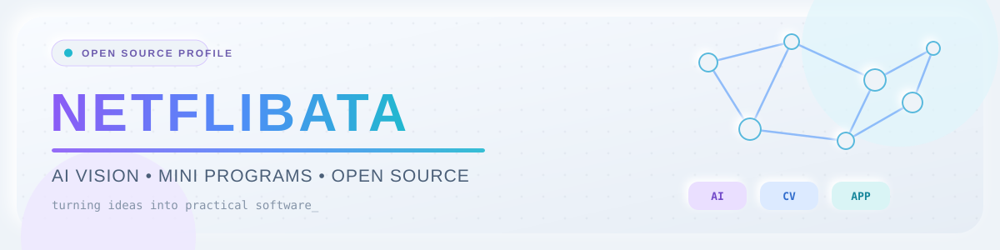
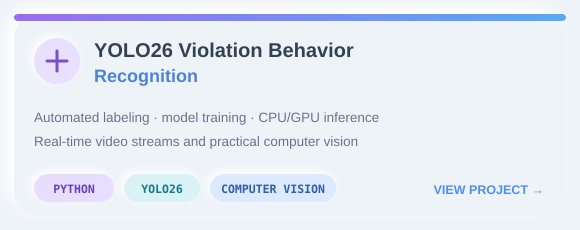
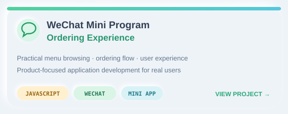
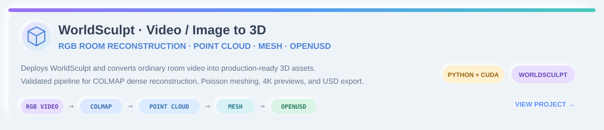
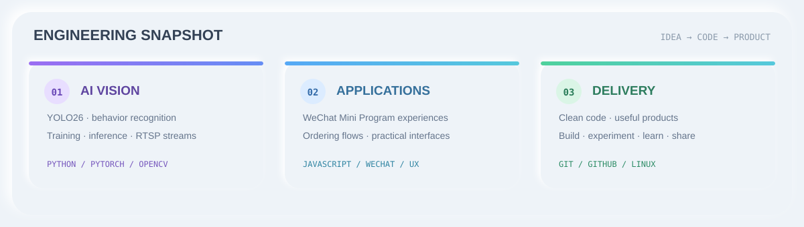
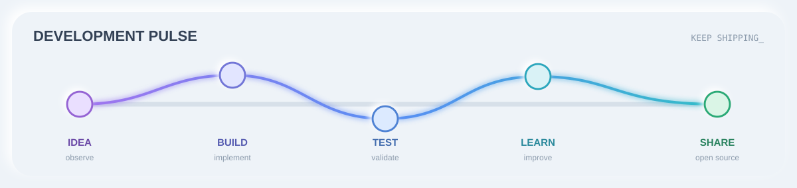

<div align="center">



<a href="https://github.com/DenverCoder1/readme-typing-svg">
  
</a>

<br />

<a href="https://github.com/antonkomarev/github-profile-views-counter">
  
</a>
<a href="https://github.com/Netflibata?tab=followers">
  
</a>
<a href="https://github.com/Netflibata?tab=repositories">
  
</a>

</div>

## 👨‍💻 About Me

> Turning ideas into practical software, one experiment at a time.

- 🔭 Building projects across **AI vision** and **application development**
- 🧠 Exploring **YOLO26**, deep learning, automated labeling, and model inference
- 🐍 Creating computer-vision tools and pipelines with **Python**
- 📱 Developing user-facing experiences with **JavaScript** and **WeChat Mini Programs**
- ⚡ Working with **CPU / GPU inference** and **RTSP video streams**
- 🌱 Learning in public and improving with every commit
- 🤝 Interested in open source, clean code, and useful real-world products
- 🌏 中文 / English

## 🎯 What I'm Building

```text
                         ┌─► Computer Vision ─► YOLO26 ─► Real-time Detection
Ideas ─► Code ─► Product│
                         └─► Mini Programs ───► Ordering ─► User Experience
```

| 🤖 AI & Computer Vision | 📱 Application Development |
|:---|:---|
| Object detection and behavior recognition | WeChat Mini Program experiences |
| Automated labeling and model training | Ordering flows and practical interfaces |
| CPU/GPU inference and RTSP streams | JavaScript-based product development |

## 🧰 Languages & Tools

<p align="center">
  <a href="https://github.com/tandpfun/skill-icons">
    
  </a>
</p>

<p align="center">
  
  
  
  
</p>

## 🚀 Featured Projects

<div align="center">

<a href="https://github.com/Netflibata/YOLO26-Violation-Behavior-Recognition">
  
</a>
<a href="https://github.com/Netflibata/weixin-program-order">
  
</a>

<br />

<a href="https://github.com/Netflibata/Worldmodel-use-video-or-img">
  
</a>

</div>

| Project | What it explores | Stack |
|:---|:---|:---|
| [**YOLO26 Violation Behavior Recognition**](https://github.com/Netflibata/YOLO26-Violation-Behavior-Recognition) | Automated labeling, model training, CPU/GPU inference, and video-stream monitoring | Python · YOLO26 · Computer Vision |
| [**WeChat Mini Program Order**](https://github.com/Netflibata/weixin-program-order) | A practical menu and ordering experience built as a WeChat Mini Program | JavaScript · WeChat Mini Program |
| [**WorldSculpt Video / Image to 3D**](https://github.com/Netflibata/Worldmodel-use-video-or-img) | Turns ordinary RGB room video into dense point clouds, meshes, 4K previews, and OpenUSD scenes | Python · WorldSculpt · COLMAP · OpenUSD · CUDA |

<p align="center">
  <a href="https://github.com/Netflibata/YOLO26-Violation-Behavior-Recognition">
    
  </a>
  <a href="https://github.com/Netflibata/weixin-program-order">
    
  </a>
  <a href="https://github.com/Netflibata/Worldmodel-use-video-or-img">
    
  </a>
</p>

## 🆕 Latest Public Projects

<!-- AUTO-PROJECTS:START -->
> 此区域由 GitHub Actions 自动维护。新上传的公开项目会自动显示在这里。
<!-- AUTO-PROJECTS:END -->

## 📊 Engineering Snapshot

<div align="center">



</div>

## 🔥 Contribution Streak

<p align="center">
  <a href="https://github.com/DenverCoder1/github-readme-streak-stats">
    
  </a>
</p>

## 📈 Development Pulse



## 🧭 Build · Learn · Share

<div align="center">

| 🔨 Build | 🧪 Experiment | 📚 Learn | 🌍 Share |
|:---:|:---:|:---:|:---:|
| Turn ideas into code | Test models and workflows | Improve through practice | Grow with open source |

<sub>Small commits compound into meaningful projects.</sub>

</div>

---

<div align="center">

<sub>✨ Profile powered by open-source projects</sub>

[readme-typing-svg](https://github.com/DenverCoder1/readme-typing-svg) ·
[skill-icons](https://github.com/tandpfun/skill-icons) ·
[github-readme-streak-stats](https://github.com/DenverCoder1/github-readme-streak-stats) ·
[github-profile-views-counter](https://github.com/antonkomarev/github-profile-views-counter) ·
[Shields.io](https://github.com/badges/shields)

<br />
<sub>Core profile artwork is stored in this repository for reliable rendering.</sub>

<br />


</div>
